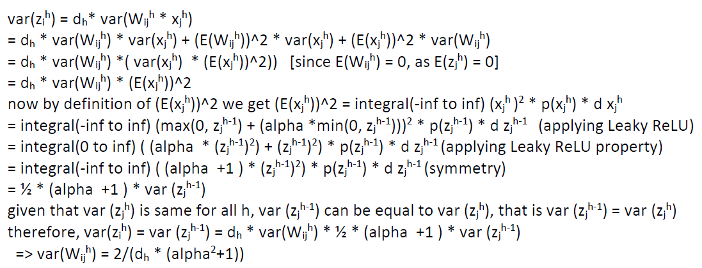

# MNIST-with-Leaky-RELU-and-PyTorch

Experiment with fully-connected neural networks using PyTorch with different depths and αs in Leaky ReLU on the MNIST dataset, where we use only the images corresponding to the digits 0 and 1 (binary classification). We used logistic loss and stochastic gradient descent to train the neural network by fine tuning the learning rate and the number of epochs. 
For this problem, we will fix the width m = 256 for all layers and we consider four depths H = 10, 20, 30, 40 and four αs: α = 2, 1, 0.5, 0.1.
As a result we plot 16 figures. Each figure corresponds to one pair of (H, α) and each figure has two curves: one corresponds to Kaiming initialization (normal distribution with variance 2/dₕ) and one corresponds to the normal distribution initialization with the variance scaling derived as above. For comparison purpose, we use the same learning rate and batch size for both initialization scalings. but have incoporated different learning rates and batches for different (H, α)s.
A example of plot is shown below:
